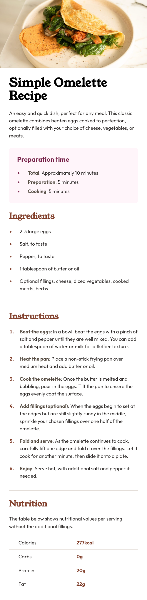

# Frontend Mentor - Recipe page solution

This is a solution to the [Recipe page challenge on Frontend Mentor](https://www.frontendmentor.io/challenges/recipe-page-KiTsR8QQKm). Frontend Mentor challenges help you improve your coding skills by building realistic projects.

## Table of contents

- [Overview](#overview)
  - [The challenge](#the-challenge)
  - [Screenshot](#screenshot)
  - [Links](#links)
- [My process](#my-process)
  - [Built with](#built-with)
  - [What I learned](#what-i-learned)
  - [Continued development](#continued-development)
  - [Useful resources](#useful-resources)
- [Author](#author)

## Overview

### Screenshot

### Links

- Solution URL: [Github Repository](https://github.com/thisisadityarao/FM-recipe-page)
- Live Site URL: [Hosted on Github Page](https://thisisadityarao.github.io/FM-recipe-page/)

## My process

### Built with

- Semantic HTML5 markup
- CSS custom properties
- Mobile-first workflow

### What I learned

I learned about **vertical rhythm** and it's importance in typography. I also learned about and used `clamp()` function to create fluid type system that is responsive to screen sizes.

### Continued development

I would want a better way to implement vertical rhythm in future challenges. Also, would to leverage custom properties for fluid type system.

### Useful resources

- [Utopia](https://utopia.fyi/) - One of the best tools to create fluid type and space systems.
- [min-max calculator](https://min-max-calculator.9elements.com/) - Much simpler version of Utopia for single interpolated values between two endpoints.

## Author

- Website - [Aditya Rao](https://adityarao.netlify.app/)
- Frontend Mentor - [@thisisadityarao](https://www.frontendmentor.io/profile/thisisadityarao)
- Twitter - [@thisisadityarao](https://www.twitter.com/thisisadityarao)
